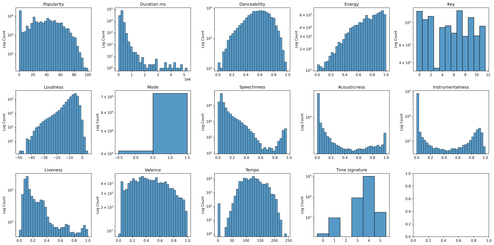
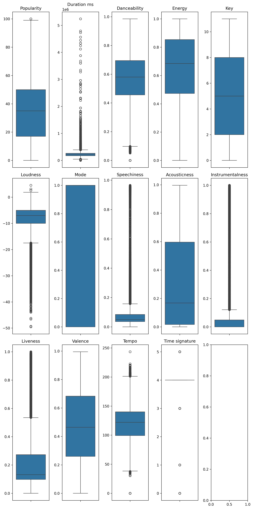
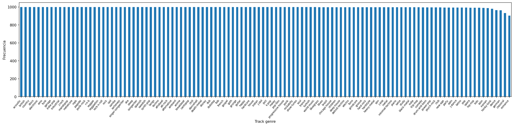

# Respuestas — Práctica Final: Análisis y Modelado de Datos

> Rellena cada pregunta con tu respuesta. Cuando se pida un valor numérico, incluye también una breve explicación de lo que significa.

---

## Ejercicio 1 — Análisis Estadístico Descriptivo
---
El _dataset_ analizado proviene de _Hugging Face_ llamado [spotify-track-dataset](https://huggingface.co/datasets/maharshipandya/spotify-tracks-dataset). Dentro hay dos tipos de ficheros: uno en _.csv_ y otro en _.parquet_. El que se ha cogido ha sido  `0000.parquet`, el cual se ha procesado previamente por el código `parquet_processing.py` para obtener nuestro fichero en `data/dataset_spotify.parquet`. El fichero original es de tamaño `13.6MB` el cual al realizar el código para el procesado se obtiene un fichero de `6.1MB` de memoria física. Tras su carga, la memoria RAM ocupada es de `27.18135 MB`.\
Este _dataset_ se centra en `11400 canciones` extraídas de la base de datos de Spotify, la cual incluye 125 diferentes géneros musicales y algunas de sus características auditivas. El dataset contiene las siguientes `20 columnas`:
  - **track_id** (str): ID de Spotify de cada canción.
  - **artists** (str): Sus artistas. Si hay más de uno, se separan con `;`.
  - **album_name** (str): El nombre del album en el que aparece.
  - **track_name** (str): El nombre de la canción.
  - **popularity** (int64): Evaluado del 0 a 100, siendo 100 el más popular, es un valor calculado por el algoritmo de Spotify y basado en mayormente en el número de reproducciones totales y recientes. `Esta va a ser la variable objetivo debido a que tiene sentido saber que popular puede ser una nueva canción dependiendo de las demás variables`.
  - **duration_ms** (int64): Duración de la canción en milisegundos.
  - **explicit** (bool): Indicador de presencia de letra explicita en la canción.
  - **danceability** (float64): Describe cuán adecuada es una canción para ser bailada, en base a la combinación del tempo, la estabilidad rítmica, la intensidad del compás y su uniformidad generalizada. Comprende entre 0.0 a 1.0.
  - **energy** (float64): Representa una medida de la intensidad de una canción. Comprende entre 0.0 y 1.0.
  - **key** (int64): Representa la tonalidad de la canción, la cual esta codificada siendo 0 Do, 2 Re, y asi sucesivamente.
  - **loudness** (float64): Los decibelios en una canción.
  - **mode** (int64): Representación la modalidad de una cación, siendo 1 Mayor y 0 Menor.
  - **speechiness** (float64): Detecta la presencia de palabras habladas. Se representa del 0.0 al 1.0.
  - **acousticness** (float64): Medida entre 0.0 y 1.0 indicando cuán acústico es la canción.
  - **instrumentalness** (float64): Medida entre 0.0 y 1.0 indicando con 1 la ausencia de vocales.
  - **liveness** (float64): Medida entre 0.0 y 1.0 indicando si hay presencia de voces de un público de fondo.
  - **valence** (float64): Medida entre 0.0 y 1.0 que indica la positividad que tiene una canción.
  - **tempo** (float64): El estimado BPM que tiene una canción. Cuanto mayor es el valor, más rápido es el ritmo de la canción. 
  - **time_signature** (int64): Un compás estimado. Su rango normal es de 3 a 7, significando compases de 3/4 a 7/4.
  - **track_genre** (str): El género de la canción.

Durante el análisis de valores nulos en la tabla, se ha visto que hay solo una canción que en las columnas de 'artist', 'album_name' y 'track_name' están nulos. Tras ver su 'track_id' se ha procedido a ver si en alguna otra fila existente con ese mismo id que estuviera relleno. Tras el análisis, no se ha encontrado otra fila igual, así que se ha decidido mantener esa fila ya que son columnas que no nos dan muchos datos para el resto del análisis y para la Regresión Lineal.\
También se ha percibido la existencia de filas completamente duplicadas, las cuales se han eliminado ya que son datos superfluos.

### Estadísticos descriptivos de variables numéricas

|                  | count  | mean         | median   | std          | variance          | Q1        | Q3        | min     | max       |
|------------------|--------|--------------|----------|--------------|-------------------|-----------|-----------|---------|-----------|
| popularity       | 113550 | 33.32410     | 35.0     | 22.28400     | 496.57120         | 17.0      | 50.0      | 0.0     | 100.0     |
| duration_ms      | 113550 | 228079.36220 | 213000.0 | 106414.78260 | 11324006218.02770 | 174180.25 | 261587.75 | 0.0     | 5237295.0 |
| danceability     | 113550 | 0.56700      | 0.58     | 0.17340      | 0.03010           | 0.456     | 0.695     | 0.0     | 0.985     |
| energy           | 113550 | 0.64210      | 0.685    | 0.25110      | 0.06300           | 0.473     | 0.854     | 0.0     | 1.0       |
| key              | 113550 | 5.30950      | 5.0      | 3.56010      | 12.67440          | 2.0       | 8.0       | 0.0     | 11.0      |
| loudness         | 113550 | -8.24340     | -6.997   | 5.01140      | 25.11390          | -9.9978   | -5.001    | -49.531 | 4.532     |
| mode             | 113550 | 0.63790      | 1.0      | 0.48060      | 0.23100           | 0.0       | 1.0       | 0.0     | 1.0       |
| speechiness      | 113550 | 0.08470      | 0.0489   | 0.10580      | 0.01120           | 0.0359    | 0.0845    | 0.0     | 0.965     |
| acousticness     | 113550 | 0.31410      | 0.168    | 0.33190      | 0.11020           | 0.0168    | 0.596     | 0.0     | 0.996     |
| instrumentalness | 113550 | 0.15570      | 0.000041 | 0.30920      | 0.09560           | 0.0       | 0.0487    | 0.0     | 1.0       |
| liveness         | 113550 | 0.21360      | 0.132    | 0.19050      | 0.03630           | 0.098     | 0.273     | 0.0     | 1.0       |
| valence          | 113550 | 0.47420      | 0.464    | 0.25920      | 0.06720           | 0.26      | 0.683     | 0.0     | 0.995     |
| tempo            | 113550 | 122.17590    | 122.02   | 29.97290     | 898.36450         | 99.2965   | 140.0738  | 0.0     | 243.372   |
| time_signature   | 113550 | 3.90420      | 4.0      | 0.43210      | 0.18670           | 4.0       | 4.0       | 0.0     | 5.0       |

Como se puede ver en la tabla anterior, la mayoría de las variables numéricas comprenden entre 0 y 1. Si nos fijamos en las medianas y en la media, se puede apreciar que en el dataset se podría esperar de que haya normalmente canciones con un indice intermedio de _'danceability'_ y las cuales tienen una Intensidad considerable. Aun así hay una contradicción en cuanto se puede esperar música con poca voz, pero también con pocos instrumentos, lo cual no tendría sentido en el aspecto de que de normal si no hay voz, pues se espera más instrumentos, y viceversa. También es raro de ver que la media de la Popularidad sea tan baja. Sin embargo, con la cantidad de datos manejadas, no es viable que más de 100000 canciones sean medianamente populares.\
Si nos centramos en la variable objetivo (_'popularity'_), tiene un **rango intercuartil** de `33.0` el cual sería 1/3 del rango entre 0 a 100. Por lo que la concentración de los datos es dentro de un rango muy bajo. En cuanto a su **Coeficiente de asimetría**, se obtiene un `0.04224`, lo cual indica una asimetría positiva muy pequeña. En cuanto a su **curtosis**, el valor es de `-0.924066`, por lo que es una Curva Platicúrtica considerable.

\
Fijándonos en los histogramas de las variable numéricas, se aprecian estos tipos de distribuciones:
- **Distribución estándar**, las cuales presentan esta forma _'popularity'_, _'danceability'_, _'loudness'_, _'tempo'_, muy levemente _'valence'_, y a mitad en _'energy'_
- **Distribución exponencial**, las cuales presentas esta forma _'duration_ms'_, _'acousticness'_ y _'liveness'_. Si se ignora los picos en la derecha, también serían _'speechiness'_ y _'instrumentalness'_.
- **Distribución Bernoulli** para la de _'mode'_.
- **Distribución multimodal** para las variables de _'key'_ y _'time_signature'_.

\
Si vemos como son sus _boxplots_, se puede apreciar que hay varias variables que presentan una cantidad considerable de _outliers_. Sin embargo en ciertos casos no nos pueden indicar certeramente que son _outliers_ debido a que no siguen una distribución normal.

Por esto, en cuanto a los outliers, se ha utilizado el método de **_z-score_** debido a que, como se ve en la gráfica de los histogramas, muchas de las variables no siguen una distribución estándar. Las variables que han salido al final que contenían son:
| Variable       | _Outliers_ | Porcentaje     |
|----------------|------------|----------------|
| duration_ms    | 965        | 0.85%          |
| danceability   | 157        | 0.14%          |
| loudness       | 2465       | 2.17%          |
| speechiness    | 2073       | 1.83%          |
| liveness       | 3628       | 3.20%          |
| tempo          | 201        | 0.18%          |
| time_signature | 1130       | 1.00%          |

A pesar de que sea una cantidad muy pequeña, en muchos casos tiene sentido eliminarlas, como son en el tempo o time_signature, las cuales no tiene sentido que tengan valor de 0, porque significarían que son canciones sin sonidos o sonidos audibles. Igualmente, se ha procedido eliminar todo estos _outliers_ ya que al final van a generar más ruido que ayudar al entrenamiento de la Regresión Lineal.

### Variables categóricas
En las siguientes representaciones no se van a poner completad debido que, a excepción del genero y _'explicit'_ que son 125 y 2 variables únicas, los valores únicos sobrepasan de los miles.

| track_id               | $F_a$ | $F_r$    |
|------------------------|-------|----------|
| 6S3JlDAGk3uu3NtZbPnuhS | 9     | 0.000086 |
| 2kkvB3RNRzwjFdGhaUA0tz | 8     | 0.000077 |
| 2Ey6v4Sekh3Z0RUSISRosD | 8     | 0.000077 |
| 2vU6bm5hVF2idVknGzqyPL | 7     | 0.000067 |
| 4GPQDyw9hC1DiZVh0ouDVL | 7     | 0.000067 |
| ..                     |       |          |
| 2C3TZjDRiAzdyViavDJ217 | 1     | 0.000010 |
| 1hIz5L4IB9hN3WRYPOCGPw | 1     | 0.000010 |
| 6x8ZfSoqDjuNa5SVP5QjvX | 1     | 0.000010 |
| 2e6sXL2bYv4bSz6VTdnfLs | 1     | 0.000010 |
| 2hETkH7cOfqmz3LqZDHZf5 | 1     | 0.000010 |

En esta tabla se puede apreciar que hay una canción en concreto que aparecen en varios album, o pueden pertenecer a más de un género musical.

| artists                              | $F_a$ | $F_r$    |
|--------------------------------------|-------|----------|
| The Beatles                          | 270   | 0.002589 |
| George Jones                         | 257   | 0.002465 |
| Stevie Wonder                        | 235   | 0.002254 |
| Ella Fitzgerald                      | 221   | 0.002120 |
| Linkin Park                          | 213   | 0.002043 |
| ...                                  |       |          |
| Bethel Music;John Wilds              | 1     | 0.000010 |
| Bethel Music;Molly Skaggs            | 1     | 0.000010 |
| Cuencos Tibetanos Sonidos Relajantes | 1     | 0.000010 |
| Bryan & Katie Torwalt;Brock Human    | 1     | 0.000010 |
| Jesus Culture                        | 1     | 0.000010 |

En esta tabla se ve que el artista solitario, y sin contar que haya hecho con otras personas, curiosamente sean `Los Beatles`.

| album_name                                                                                    | $F_a$ | $F_r$    |
|-----------------------------------------------------------------------------------------------|-------|----------|
| Alternative Christmas 2022                                                                    | 195   | 0.001870 |
| Feliz Cumpleaños con Perreo                                                                   | 175   | 0.001678 |
| Metal                                                                                         | 140   | 0.001343 |
| Halloween con perreito                                                                        | 118   | 0.001132 |
| Halloween Party 2022                                                                          | 113   | 0.001084 |
| ...                                                                                           |       |          |
| The Light Meets The Dark                                                                      | 1     | 0.000010 |
| HUMAN (Deluxe) [Live]                                                                         | 1     | 0.000010 |
| #20 Sueños Vividos - Música Intrumental Suave 2018 para Dormir Bien y Relajarse Profundamente | 1     | 0.000010 |
| Frecuencias Álmicas en 432hz (Solo Piano)                                                     | 1     | 0.000010 |
| Revelation Songs                                                                              | 1     | 0.000010 |

En esta tabla es curioso que las canciones de navidad o de festividades con cierto ritmo musical sean de la que más canciones incluyan.

| track_name                     | $F_a$ | $F_r$    |
|--------------------------------|-------|----------|
| Run Rudolph Run                | 151   | 0.001448 |
| Halloween                      | 87    | 0.000834 |
| Frosty The Snowman             | 80    | 0.000767 |
| Little Saint Nick - 1991 Remix | 74    | 0.000710 |
| Christmas Time                 | 72    | 0.000691 |
| ...                            |       |          |
| Frecuencia Álmica, Pt. 4       | 1     | 0.000010 |
| Sleep My Little Boy            | 1     | 0.000010 |
| Water Into Light               | 1     | 0.000010 |
| Miss Perfumado                 | 1     | 0.000010 |
| Barbincor                      | 1     | 0.000010 |

Y por la misma razón que la anterior, que las primeros nombres que sean de temática de festividad es interesante.

| track_genre | $F_a$ | $F_r$    |
|-------------|-------|----------|
| rock        | 996   | 0.009552 |
| mandopop    | 994   | 0.009533 |
| country     | 993   | 0.009523 |
| house       | 991   | 0.009504 |
| deep-house  | 989   | 0.009485 |
| ...         |       |          |
| ambient     | 666   | 0.006387 |
| piano       | 644   | 0.006176 |
| classical   | 576   | 0.005524 |
| sleep       | 250   | 0.002398 |
| comedy      | 164   | 0.001573 |

En cuanto al genero musical, se puede ver que lo que más abundan son tipo `rock` o `pop`.

| explicit | $F_a$ | $F_r$    |
|----------|-------|----------|
| False    | 95710 | 0.917905 |
| True     | 8560  | 0.082095 |

Es normal que la mayoría de las canciones intente ser lo menos explicitas posibles, ya que así llegaría a más audiencia.

En este apartado, se va a ver el histograma de 'track_genre' debido a que es el más interesante a analizar, ya que en las demás siguen como una distribución exponencial, y es la que menos elementos únicos contiene.

\
Esta gráfica junto a la tabla anteriormente vista, se puede ver que la gran parte de los más representativos no hay una diferencia enorme. Si que se puede concluir que la moda es el `rock`, pero hasta casi los  últimos géneros menos representativos, se podría considerar una distribución uniforme. Aun así, no se podría considerar balanceada, ya que hay ciertos elementos que aparecen más que otros.

## Correlaciones
> 

Según la gráfico con las correlaciones, se puede apreciar que hay dos pares de valores que destacan, los cuales serían:
 - _'loudness'_ y _'energy'_ com un 0.77, el cual tiene sentido que cuanto más ruidosa es una música, más intensa sea.
 - _'accoustiness'_ y _'energy'_ con un -0.73, el cual tiene sentido que cuanto más intensa sea una canción, tenga una armonía o sea una música más suave.

No se aprecia en ningún par sean multicolineal, ya que ninguno llega a límite de superar 0.9 en su puntuación. Aun así el primer par expuesto anteriormente habría que tener cuidado, ya que si que es un valor muy alto para poder indicar multicolinealidad.

En cuanto a la variable objetivo (_'popularity'_), las tres variables con mayor correlación con la objetivo son:
 - **_Instrumentalness_** con un -0.10
 - **_Loudness_** con un 0.06
 - **_Valence_** con un -0.05

Fijándonos en esta parte, que las mayores correlaciones con la variable objetivo llegue a rozar a 0.10 no es buena señal que la solución pueda ser lineal. Si se ven las gráficas que se muestran a continuación, se puede aprecia que, sin contar con su propia variable, en la mayoría de los casos es una nube de puntos sin ninguna dirección o un posible indice de recta. 

> 

---

**Pregunta 1.1** — ¿De qué fuente proviene el dataset y cuál es la variable objetivo (target)? ¿Por qué tiene sentido hacer regresión sobre ella?

> El _dataset_ proviene de _Hugging Face_ llamado [spotify-track-dataset](https://huggingface.co/datasets/maharshipandya/spotify-tracks-dataset). Este dataset contiene datos relevantes y propiedades físicas especificas de las canciones que hay dentro de Spotify. Dentro hay dos tipos de ficheros: uno en _.csv_ y otro en _.parquet_. El que se ha cogido ha sido  `0000.parquet`, el cual se ha procesado previamente por el código `parquet_processing.py` para obtener nuestro fichero en `data/dataset_spotify.parquet`. \
> La variable objetivo va a ser `popularity` debido a que es el que más sentido tiene a analizar si lo que queremos saber si, queriendo crear una nueva canción, cual podría ser su popularidad mediante sus características.

**Pregunta 1.2** — ¿Qué distribución tienen las principales variables numéricas y has encontrado outliers? Indica en qué variables y qué has decidido hacer con ellos.

> Se presenta varios tipos de distribuciones:
> - **Distribución estándar**, las cuales presentan esta forma _'popularity'_, _'danceability'_, _'loudness'_, _'tempo'_, muy levemente _'valence'_, y a mitad en _'energy'_
> - **Distribución exponencial**, las cuales presentas esta forma _'duration_ms'_, _'acousticness'_ y _'liveness'_. Si se ignora los picos en la derecha, también serían _'speechiness'_ y _'instrumentalness'_.
> - **Distribución Bernoulli** para la de _'mode'_.
> - **Distribución multimodal** para las variables de _'key'_ y _'time_signature'_.
>
>En cuanto a los _outliers_, utilizando el método de **_z-score_** debido a que muchas de las variables no siguen una distribución estándar, se ha encontrado en las siguientes variables:
>| Variable       | _Outliers_ | Porcentaje     |
>|----------------|------------|----------------|
>| duration_ms    | 965        | 0.85%          |
>| danceability   | 157        | 0.14%          |
>| loudness       | 2465       | 2.17%          |
>| speechiness    | 2073       | 1.83%          |
>| liveness       | 3628       | 3.20%          |
>| tempo          | 201        | 0.18%          |
>| time_signature | 1130       | 1.00%          |
>
>A pesar de que sea una cantidad muy pequeña, en muchos casos tiene sentido eliminarlas, como son en el tempo o time_signature, las cuales no tiene sentido que tengan valor de 0, porque significarían que son canciones sin sonidos o sonidos audibles. Igualmente, se ha procedido eliminar todo estos _outliers_ ya que al final van a generar más ruido que ayudar al entrenamiento de la Regresión Lineal.


**Pregunta 1.3** — ¿Qué tres variables numéricas tienen mayor correlación (en valor absoluto) con la variable objetivo? Indica los coeficientes.

> 
> Las tres variables con mayor correlación con la variable objetivo (_'popularity'_) son:
> - **_Instrumentalness_** con un -0.10
> - **_Loudness_** con un 0.06
> - **_Valence_** con un -0.05

**Pregunta 1.4** — ¿Hay valores nulos en el dataset? ¿Qué porcentaje representan y cómo los has tratado?

> En todo el dataset, hay solo una canción que en las columnas de 'artist', 'album_name' y 'track_name' están nulos. Su porcentaje es casi 0, y la forma de solucionarlo ha sido ver si en alguna otra fila existe el mismo 'track_id' que estuviera relleno. Tras el análisis, no se ha encontrado otra fila igual, así que se ha decidido mantener esa fila ya que son columnas que no nos dan muchos datos para el análisis.

---

## Ejercicio 2 — Inferencia con Scikit-Learn

---

Como ya se había puntualizado en el apartado anterior, nuestra variable objetivo va a ser la columna _'popularity'_, la cual indica cuán popular es una canción en Spotify. Esta variable objetivo tendrá como parámetros todas las columnas numéricas, booleanas y la columna _'track_genre'_, que indica a que genero pertenece, para el entrenamiento de una Regresión Lineal. Para ello se ha realizado lo siguiente:
1. **Carga y preprocesamiento:** Tras cargar el dataset con los outliers anteriormente eliminados, se realiza un preprocesamiento de los datos. En este preprocesamiento se ha realizado:
    - Se ha puesto todos los tipos booleanos a tipo entero (_Integer_) para que sea más fácil procesarlos.
    - Se ha transformado la columna _'track_genre'_ mediante un _LabelEncoder_. A pesar de que esta variable nominal no tenga un orden lógico, como, por ejemplo, el orden de los nombres de una membresía, se ha realizado esta transformation antes que un _OneHotEncoder_ debido a la existencia de 125 valores únicos. Esto hubiera dificultado en una cantidad considerable en el entrenamiento de la Regresión lineal.
    - Se ha eliminado las columnas que no nos resultaban interesantes de mantener para una Regresión, las cuales son _'track_id'_, _'artists'_, _'album_name'_ y _track_name'. Estas variables en su esencia son clasificadores para saber que canción estamos analizando, pero tener miles de _Label_ diferentes entorpecería más el entrenamiento que ayudarlo.
    - A continuación se ha obtenido los valores de la variable objetivo y sus parámetros (y, X) y se ha hecho un escalado estandarizado para que todas las variables estén dentro de los mismo rangos.
    - Por último se ha dividido los datos en X e y en dos partes: una parte de los datos para hacer el Entrenamiento, y la otra para hacer el Test del entrenamiento.
2. **Regresión lineal**: ya una vez obtenido los conjuntos para el Entrenamiento y el Test, se procede a entrenar nuestra regresión lineal con nuestro conjunto de Entrenamiento. Tras su entrenamiento, se ha realizado los test de MAE, RMSE y Coeficiente de determinación tanto para los conjuntos de Entrenamiento como el de Test. Junto a ello también se ha realizado para ambos conjuntos el gráfico de a nube de residuos. También se ha visto cuales son las variables más influyentes.
```
Métricas de predicción
==================================================
Entrenamiento
	MAE: 0.8252112312629936
	RMSE: 0.987137955443251
	R²: 0.02777615520546084
Test
	MAE: 0.8170351263960781
	RMSE: 0.979352008643907
	R²: 0.03202994966957806

Top 10 influencia de las variables:
             Feature  Coefficient  Absolute
11           valence    -0.110331  0.110331
9   instrumentalness    -0.103368  0.103368
5           loudness     0.067642  0.067642
2       danceability     0.064913  0.064913
3             energy    -0.062209  0.062209
7        speechiness    -0.053142  0.053142
1           explicit     0.041266  0.041266
13    time_signature     0.033455  0.033455
12             tempo     0.025690  0.025690
14       track_genre     0.019396  0.019396
```
\
Como se ve en los resultados tanto de la gráfica como de las métricas, el entrenamiento con una Regresión lineal no es la adecuada. Sin duda alguna el modelo ha sufrido un grave problema de subajuste. Como era esperable, las variables más influyentes en nuestro modelo son las mismas que se había obtenido en la gráfica de correlaciones.

En conclusión, el resultado del modelo ha sido muy malo, pero ya en el Ejercicio 1 con las correlaciones y como estaban distribuidos los datos de 'popularity' con las otras columnas, era esperable que se pudiera conseguir un buen modelo. Es probable que nuestra solución no sea usando una Regresión Lineal.\
Se podría mejorar nuestro modelo viendo cambiando de variable objetivo. Un posible candidato podría ser _'danceability'_, la cual indica lo adecuado que es una canción para ser bailado en base a su tempo, la estabilidad rítmica, la intensidad del compás y 
su uniformidad generalizada. Por lo tanto, se podría analizar si nuevas canciones puedan usarse en, por ejemplo, discotecas, las cuales se busca canciones bailables. Esta variable, si se ve el mapa de calor de las correlaciones, tiene mejores correlaciones que _'popularity'_ por lo que nos daría un mejor modelo.

### Modelo usando _danceability_

```
Métricas de predicción
==================================================
Entrenamiento
	MAE: 0.6608590071047686
	RMSE: 0.8277739124639447
	R²: 0.3154783716549552
Test
	MAE: 0.6616785246084106
	RMSE: 0.8260929762719117
	R²: 0.3148114037157054

Top 10 influencia de las variables:
             Feature  Coefficient  Absolute
11           valence     0.491814  0.491814
3             energy    -0.349091  0.349091
8       acousticness    -0.214479  0.214479
5           loudness     0.194547  0.194547
12             tempo    -0.131065  0.131065
7        speechiness     0.125268  0.125268
10          liveness    -0.107785  0.107785
13    time_signature     0.095191  0.095191
9   instrumentalness     0.074361  0.074361
2           explicit     0.071289  0.071289
```


---

**Pregunta 2.1** — Indica los valores de MAE, RMSE y R² de la regresión lineal sobre el test set. ¿El modelo funciona bien? ¿Por qué?

>| Medida | Valor obtenido |
>|--------|----------------|
>| $MAE$  | $0.817035$     |
>| $RMSE$ | $0.979352$     |
>| $R^2$  | $0.032029$     |
>
> Como se ve en el `Coeficiente de determinación`, el modelo no funciona, es como si no hubiera ningún modelo. Esto es debido a, como hemos podido ver en el apartado anterior, la variable objetivo _'popularity'_ no tiene apenas correlación con alguna de las variables, y tampoco en la gráfica de puntos a pares con la variable objetivo se puede apreciar una linealidad. Por lo que nuestra solución no va a ser lineal.


---

## Ejercicio 3 — Regresión Lineal Múltiple en NumPy

---

\
Tras la realización de la Regresión Lineal Multiple y realizar con el conjunto de Test las predicciones, se puede ver la diferencia entre los puntos en donde se debería de posicionar y donde se han posicionado. Siendo la recta roja el caso ideal, se puede apreciar que hay muy pocos puntos en la que llegan a tocar la linea ideal. Esto podría indicar que, o la Regresión Lineal Multiple para este caso no es lo más adecuado, o que el conjunto de puntos no sea linear o que hubiera un sobreajuste significativo para el entrenamiento y dejando lugar a que nuevos valores no se puedan analizar correctamente.

---

**Pregunta 3.1** — Explica en tus propias palabras qué hace la fórmula β = (XᵀX)⁻¹ Xᵀy y por qué es necesario añadir una columna de unos a la matriz X.

> Partiendo de la formula $X\beta=y$, la parte $(X^TX)^{-1}$ proviene de la parte de $\beta$ en la que $X^TX$ se realiza para la obtención del autovector, y después su inversa para resolver la ecuación; y $X^Ty$ en la que $X^T$ viene de hacer la pseudoinversa de X, y dando lugar a la magnitud del vector. Por lo tanto, teniendo el autovector inverso y la magnitud del vector, se obtiene en donde está el intercepto y la n-pendiente de la recta.\
> En cuanto a añadir una fila de 1 a la matriz X al principio es para calcular el intercepto. Si se realizara con sólo X, se obtendría de la regresión únicamente la n-pendiente de la recta, que serían los valores de los parámetros a analizar.

**Pregunta 3.2** — Copia aquí los cuatro coeficientes ajustados por tu función y compáralos con los valores de referencia del enunciado.

>| Parámetro | Valor real | Valor ajustado |
>|-----------|-----------|----------------|
>| β₀        | 5.0       | 4.864995       |
>| β₁        | 2.0       | 2.063618       |
>| β₂        | -1.0      | -1.117038      |
>| β₃        | 0.5       | 0.438517       |

**Pregunta 3.3** — ¿Qué valores de MAE, RMSE y R² has obtenido? ¿Se aproximan a los de referencia?

>Los valores obtenidos son los siguientes:
>
>| Medida | Valor referencia| Valor obtenido |
>|--------|-----------------|----------------|
>| $MAE$  | $1.20 (\pm 0.2)$| $1.166462$     |
>| $RMSE$ | $1.50 (\pm 0.2)$| $1.461243$     |
>| $R^2$  |$0.80 (\pm 0.05)$| $0.689672$     |
>
>Como se puede ver, tanto en el MAE como en el RMSE se aproximan al valor de >referencia, aunque no se incluya en el rango de error esperado. En cuanto al coeficiente de error es mucho menor al esperado, incluso con el rango de error. 

---

## Ejercicio 4 — Series Temporales
---

\
En la gráfica de la serie temporal original se puede ver que hay una tendencia ascendente en el tiempo, en la que cada año aumenta los valores en cada uno de los ciclos. Se podría deducir que esta serie es adictiva, ya que no se ve que en cada periodo haya un cambio significativo en el periodo o la forma de cada ciclo.

\
Viendo la gráfica de la descomposición se puede ver claramente lo que había extraído antes, en la que la tendencia aumenta, pero de una forma como si fuera una ecuación de cuarto grado. También se aprecia claramente los ciclos, los cuales parecen ser anuales. En cuanto al residuo da la sensación que se distribuye consistentemente en casi todo el tiempo.

Si se revisa el residuo, se podría comprobar que la descomposición nos da todos los resultados y no hay más datos que puedan estar ocultos.

\
Si se realiza al residuo las evaluaciones de ACF y PACF, se puede comprobar que no hay _lag_ significativos, menos el 0. Esto indica que no hay ningún ciclo ni otras variables que con la descomposición no hayamos capturado.

\
Y si nos fijamos en como esta distribuido el histograma del ruido, se puede apreciar que sigue una distribución estándar. Por lo tanto el ruido sigue un patrón de variabilidad normal, y su inferencia se puede eliminar fácilmente de la serie temporal para solamente tener la tendencia y la estacionalidad.

---

### ej4_analisis.txt
```
Análisis estadístico para el residuo
==================================================
  Media  : 0.13
  Desviación Estándar : 3.22
  Asimetría   : -0.05 => Asimetría negativa
  Curtosis   : -0.06 => Curva Platicúrtica
--------------------------------------------------
  Test de normalidad Shapiro-Wilk o Jarque-Bera (p-value)  : 0.58 => Se acepta normalidad
  ADF Test para verificar estacionariedad (p-value)  : 0.00 => Se acepta estacionariedad
```
---

**Pregunta 4.1** — ¿La serie presenta tendencia? Descríbela brevemente (tipo, dirección, magnitud aproximada).

> Se puede apreciar que sigue una tendencia positiva, en la que en cada ciclo va aumentando los valores. Por lo tanto, es una tendencia positiva, con una dirección un poco exponencial (entre 1.1 a 1.3), siendo el incremento en su menor valor en cada ciclo de: 
> - 50
> - 60 (aumento de 10)
> - 75 (aumento de 15)
> - 95 (aumento de 20)
> - 120 (aumento de 25)
> - 140 (aumento de 20)

**Pregunta 4.2** — ¿Hay estacionalidad? Indica el periodo aproximado en días y la amplitud del patrón estacional.

> Se puede apreciar una estacionalidad, la cual se podía considerar anual, por lo tanto, con un periodo de aproximadamente 365 días. 

**Pregunta 4.3** — ¿Se aprecian ciclos de largo plazo en la serie? ¿Cómo los diferencias de la tendencia?

> No se aprecia ciclos de largo plazo en la serie, ya que no se ve que la forma de la estacionalidad cambie abruptamente. Se diferencia de la tendencia en el sentido que la tendencia sólo guía la dirección en la que se dirige la serie, mientras que el ciclo hace que aumente o la longitud o la forma en la que se presenta cada periodo, ya sea en aumento o en decremento.  

**Pregunta 4.4** — ¿El residuo se ajusta a un ruido ideal? Indica la media, la desviación típica y el resultado del test de normalidad (p-value) para justificar tu respuesta.

> Como se puede ver tanto en el análisis estadístico del residuo como en el histograma con el KDE del residuo, el ruido sería ideal. En la gráfica se ve que sigue una curva normal o estándar, y en los resultados del **p-value** ($0.58$) de Jarque-Bera nos indica que hay que rechazar el caso nulo ($H_0$), por lo tanto se acepta que una curva normal. Esto también tiene sentido en el aspecto que la **media** es cercana a 0 ($0.13$) y una **asimetría** y **curtosis** casi de 0 ($-0.05$ y $-0.06$). Por último, la **desviación estándar** es de $3.22$, lo cual solo nos indica que los datos están algo más disperso.

---

*Fin del documento de respuestas*
